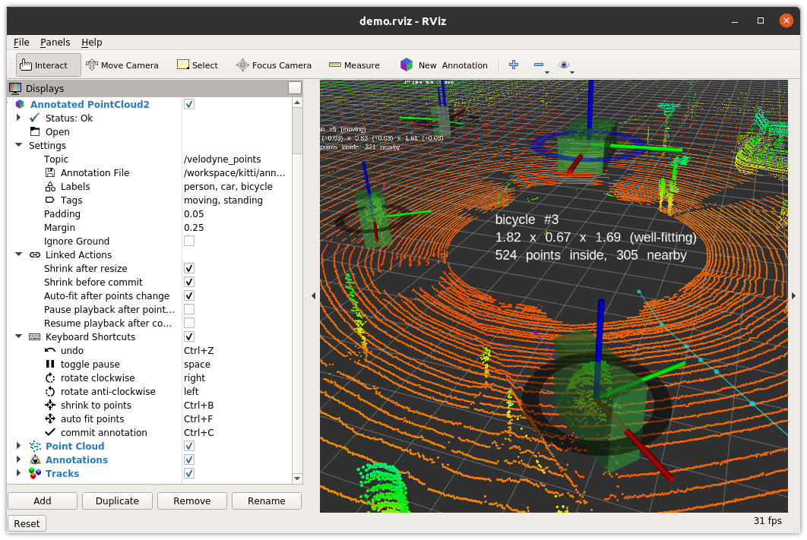

# For classification

欧阳俊源-oyjy：标注配置文件 annotate.yaml

```yaml
labels:
  - car: 0
  - ironpile: 0
  - other: 0
  - pedestrian: 0
  - tree: 0
dataset_root: /home/ou/Documents/dataset/my_dataset
tags:
  - test: 0
  - train: 0
  - val: 0
```

然后操作和原版一致

# annotate


The evaluation of perception algorithms requires labeled ground truth data. Supervised machine learning algorithms need labeled training data. Annotate is a tool to create 3D labeled bounding boxes in ROS/RViz. Its labeled data is useful both as training data for machine learning algorithms as well as ground truth for evaluation.

## Requirements

Annotate is useful in the following contexts:

* You are using ROS. Annotate was tested with ROS Kinetic (Ubuntu 16.04) and ROS Melodic (Ubuntu 18.04).
* Your data is available in (or can easily be converted to) [3D point clouds](http://wiki.ros.org/pcl).

## Overview

Create annotations (labeled data) using RViz. Annotate provides RViz extensions for labeling. You are responsible to provide labeling data using a ROS topic with [sensor_msgs/PointCloud2](http://docs.ros.org/melodic/api/sensor_msgs/html/msg/PointCloud2.html) data.

* Use ```rosbag play``` or similar tooling to provide point cloud data to be annotated in ```sensor_msgs/PointCloud2``` format
* Start ```rviz``` from a ROS workspace including this repository to create and edit annotation tracks
* Labeled data is stored in a YAML file of your choice
See [labeling](docs/labeling.md) for a detailled description of label creation.

## Getting Started

Clone this repository in a ROS workspace to build and run annotate. For a successful build please install the dependency pcl-ros as well. You can also use rosdep to pick it up for you.

```bash
cd /path/to/your/workspace/src
git clone https://github.com/Earthwings/annotate.git
catkin build  # or catkin_make or your other favorite build method
source /path/to/your/workspace/devel/setup.bash  # or setup.zsh for ZSH users
```

Use the ```demo.launch``` launch file shipped with annotate to see it in action quickly. Here is a sample call:

```bash
roslaunch annotate demo.launch \
  bag:="/kitti/2011_09_26_drive_0005_sync_pointcloud.bag --pause-topics velodyne_points"
```

The above call will run ```rosbag play``` and RViz using a configuration file that includes the annotate RViz tool and the annotate RViz display. In the annotate display set the topic with to be labeled data to ```/velodyne_points```. The RViz window will look similar to this:



Please see [labeling](docs/labeling.md) for a detailed description of label creation.

---


